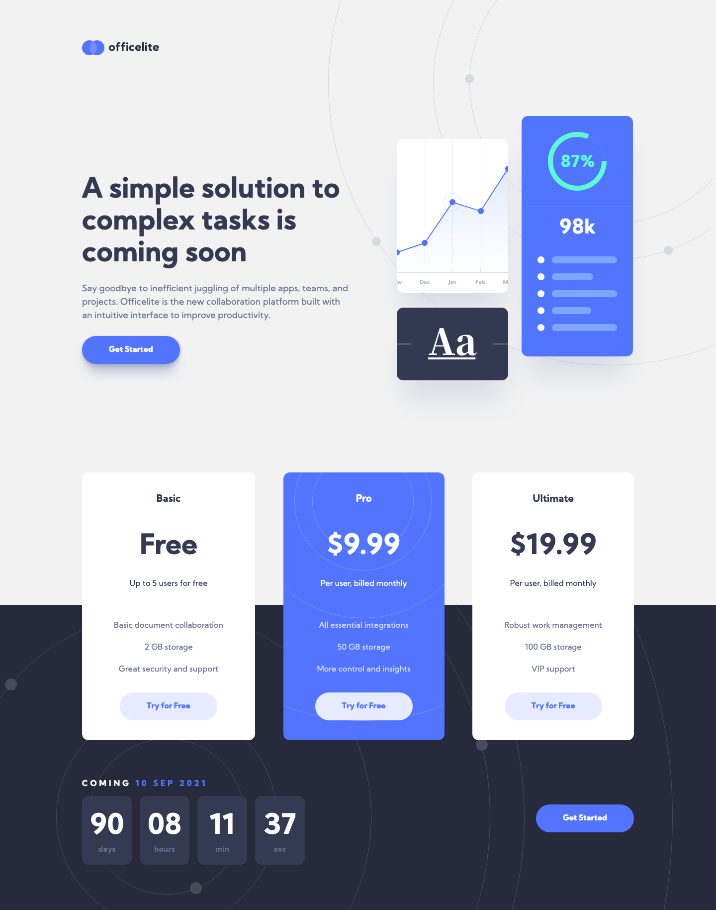
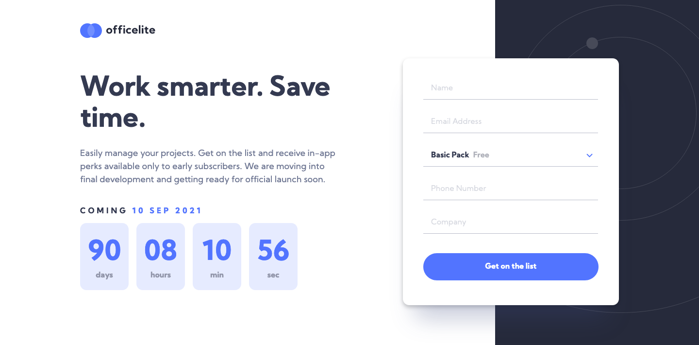
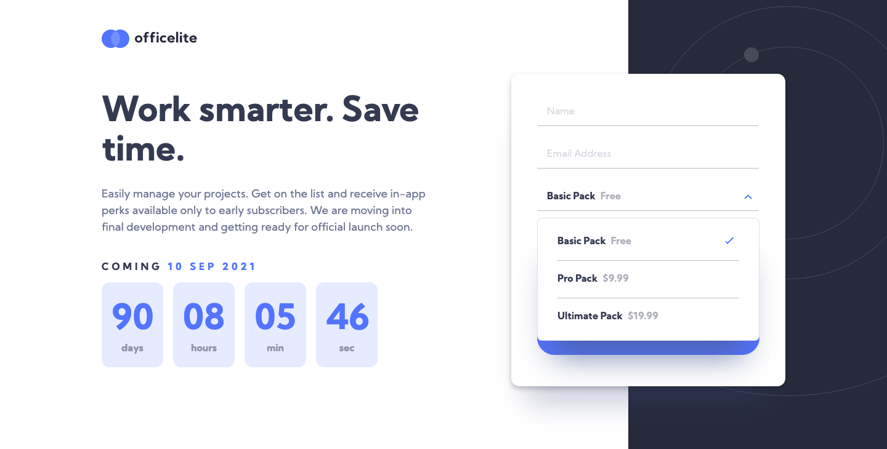
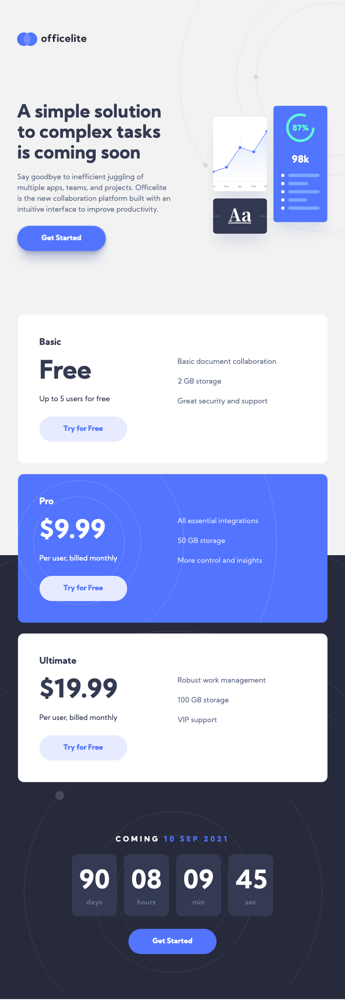
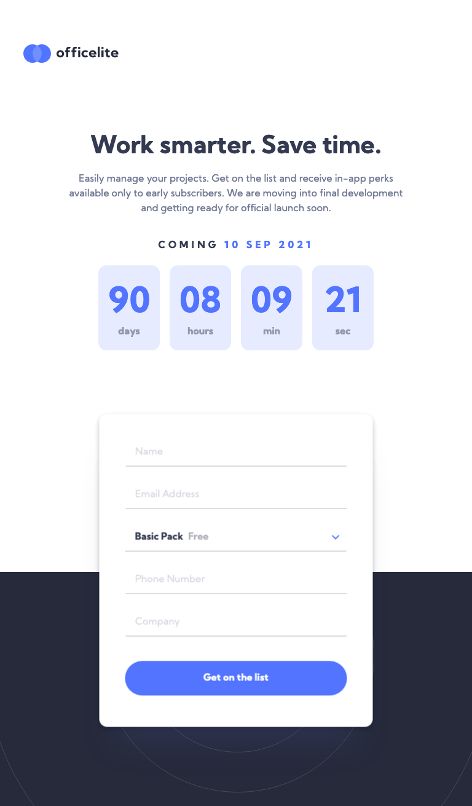
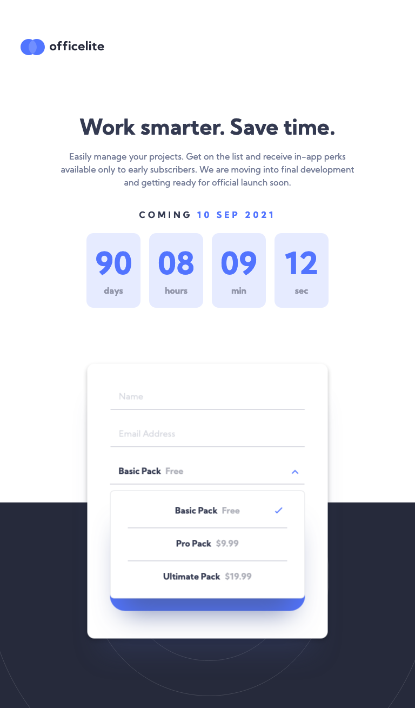
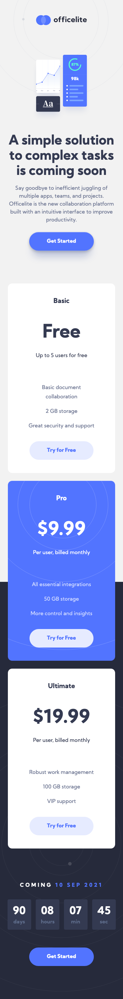
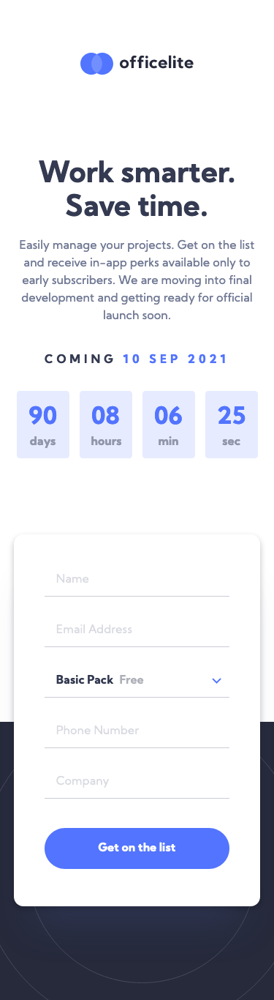
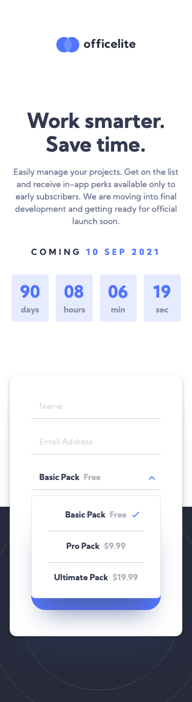

# Frontend Mentor - Officelite coming soon site solution

This is a solution to the [Officelite coming soon site challenge on Frontend Mentor](https://www.frontendmentor.io/challenges/officelite-coming-soon-site-M4DIPNz8g). Frontend Mentor challenges help you improve your coding skills by building realistic projects. 

## Table of contents

- [Overview](#overview)
  - [The challenge](#the-challenge)
  - [Screenshot](#screenshot)
  - [Links](#links)
- [My process](#my-process)
  - [Built with](#built-with)
  - [What I learned](#what-i-learned)
  - [Useful resources](#useful-resources)
- [Author](#author)

## Overview

### The challenge

Users should be able to:

- View the optimal layout for the site depending on their device's screen size
- See hover states for all interactive elements on the page
- See error states when the contact form is submitted if:
  - The `Name` and/or `Email Address` fields are empty
  - The `Email Address` is not formatted correctly
- **Bonus**: See a live countdown timer that ticks down every second
- **Bonus**: See a custom-styled `select` form control in the sign-up form

### Screenshot

  
Desktop

  
Tablet

  
Mobile

### Links

- Solution URL: [Frontend Mentor Solution]()
- Live Site URL: [Github Pages](https://rzvr.github.io/officelite-coming-soon-site/)

## My process

### Built with

- Semantic HTML5 markup
- CSS variable
- SASS
- BEM
- Flexbox
- Gulp

### What I learned

### Continued development

Use this section to outline areas that you want to continue focusing on in future projects. These could be concepts you're still not completely comfortable with or techniques you found useful that you want to refine and perfect.

### Useful resources

- [Youtube](https://www.youtube.com/user/KepowOb) - Great channel about HTML and CSS.
- [Ninja Units](https://www.ninjaunits.com/) - A site where you can convert all possible and necessary in the creation of sites units.

## Author

- Github - [rzvr](https://github.com/rzvr)
- LinkedIn - [rzvr](https://www.linkedin.com/in/roman-zvir-8a4394214)
- Codewars - [rzvr](https://www.codewars.com/users/rzvr)
- Frontend Mentor - [@rzvr](https://www.frontendmentor.io/profile/rzvr)
